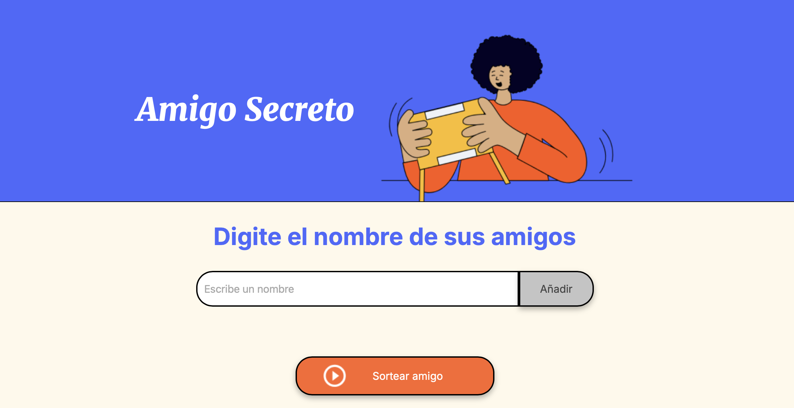

# Amigo Secreto

Este es un proyecto simple de una aplicación web para sortear un amigo secreto.

## Estructura del Proyecto

- `app.js`: Contiene la lógica de la aplicación.
- `assets/`: Carpeta que contiene las imágenes utilizadas en el proyecto.
- `index.html`: Archivo HTML principal.
- `style.css`: Archivo de estilos CSS.

## Funcionalidades

- Añadir amigos a una lista.
- Mostrar la lista de amigos.
- Sortear un amigo secreto de la lista.

## Cómo usar

1. Clona el repositorio.
2. Abre el archivo `index.html` en tu navegador.
3. Escribe el nombre de un amigo en el campo de texto y haz clic en "Añadir".
4. Para sortear un amigo secreto, haz clic en el botón "Sortear amigo".

## Tecnologías Utilizadas

- HTML
- CSS
- JavaScript

## Capturas de Pantalla

## Autor

- [Ana Sayago](https://github.com/anasayago)
